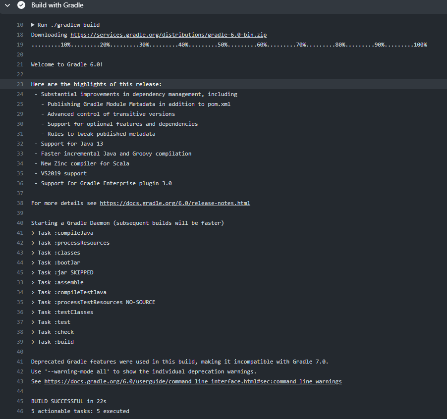

# MyGitHubActionsJavaApp

My GitHub Actions Java app

## Screenshot


GitHub Actions Workflow in old version syntax

```
name: Java CI with Gradle

on:
  push:
    branches: [ main ]
  pull_request:
    branches: [ main ]

permissions:
  contents: read

jobs:
  build:

    runs-on: ubuntu-latest

    steps:
    - uses: actions/checkout@v2

    - name: Set up JDK 1.8
      uses: actions/setup-java@v1
      with:
        java-version: 1.8

    - name: Grant execute permission for gradlew
      run: chmod +x gradlew

    - name: Build with Gradle
      run: ./gradlew build

    - name: Build and Push Docker Image
      uses: mr-smithers-excellent/docker-build-push@v4
      with:
        image: briansu2004/github-actions-demo-java-app-gradle-simple
        registry: docker.io
        username: ${{ secrets.DOCKER_USERNAME }}
        password: ${{ secrets.DOCKER_PASSWORD }}
```





## Troubleshooting

### Error: Gradle script '/home/runner/work/.../gradlew' is not executable

```
    - name: Make gradlew executable
      run: chmod +x ./gradlew
```

### Error: Could not find or load main class org.gradle.wrapper.GradleWrapperMain

Too many catches

- Update Gradle wrapper

- Make sure JDK matches Gradle

- Verify with IntelliJ
